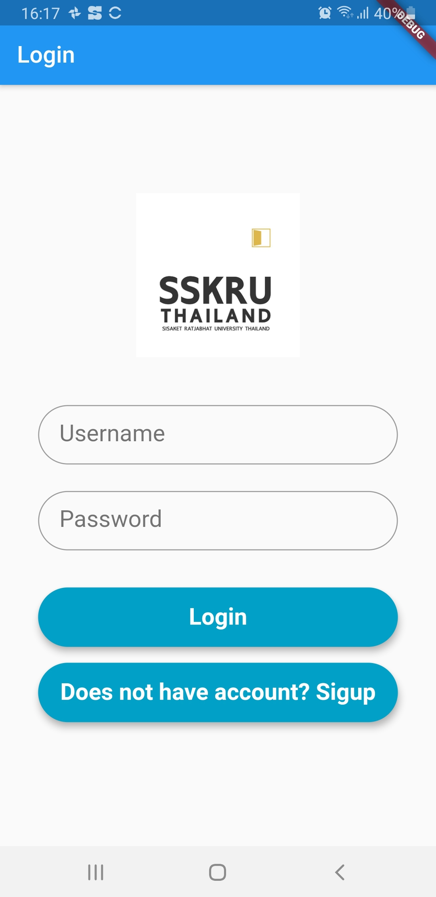
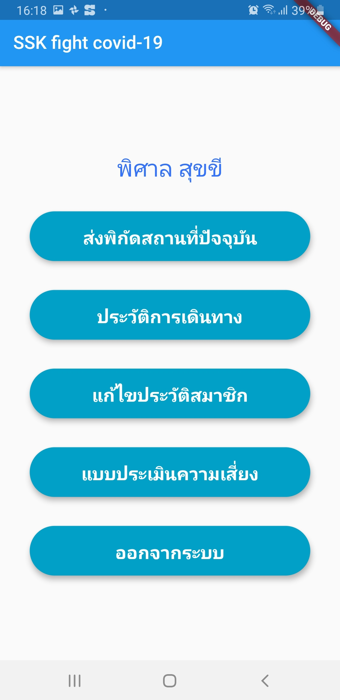
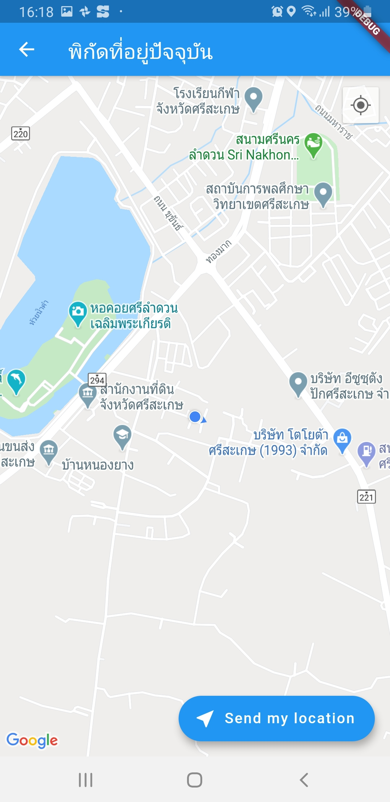

# sskcovid19

SSK Fight Covid 19

สำหรับโปรเจคนี้ ผู้พัฒนาได้พัฒนาขึ้นมาอย่างเร่งด้วย โดยเป็นการทำงานร่วมกันระหว่าง Mobile Application และ Web Application ที่สื่อสารกันผ่าน RESTful Web Services โดยมีแนวคิดในการพัฒนาโปรแกรมส่วนของ Mobile Application ให้มีความสามารถดังต่อไปนี้

1. สามารถลงทะเบียนสมัครเข้าใช้ระบบผ่านโปรแกรมมือถือ
2. สามารถล็อคอินเข้าใช้งานระบบ
3. รายงานพิกัดสถานที่ที่ตนเองเดินทางเข้าไปเป็นเป็นประวัติการเดินทางของตนเอง
4. สามารถแก้ไข/บันทึก ประวัติส่วนตัวที่จำเป็น เพื่อให้เจ้าหน้าที่รัฐสามารถติดต่อ หรือนำไปใช้เป็นข้อมูลพื้นฐานได้ในกรณีเกิดเหตุติดเชื้อ
5. สามารถเรียกดูประวัติการเดินทางรายบุคคลได้
6. การส่งพิกัดต่าง ๆ จะกระทำโดยสมัครใจ ไม่มีการแอบดึงพิกัดที่อยู่ หรือข้อมูลส่วนตัวอื่น ๆ

โปรแกรมในส่วนของ Mobile Application ผู้พัฒนาเลือกใช้ Flutter สำหรับการเขียน Mobile Application

ความสามารถในส่วนของ Mobile Application นี้จะหน้าเป็น Front-end ที่จะคอยดึงมูลจาก Web Application ผ่าน API และนำมาแสดงผลผ่านหน้าจอมือถือ

หรือมีการประมวลผลข้อมูลต่าง ๆ ในส่วนของ Mobile Application เช่น การแก้ไขข้อมูลประวัติสมาชิก หรือ การส่งพิกัดที่อยู่ปัจจุบันของสมาชิก นั้น Mobile Application จะทำการประมวลผล และส่งข้อมูลผ่าน API เพื่อให้ Web Application ทำการบันทึกต่อไป

# SSKCovid19 (Sisaket Fight Covid-19)

